# Turist-agency-SoftwareDevelopment1
 This is a project for Software Development 1. It's made using Angular CLI and ASP.NET. This is a group project of three people.
 
 Home screen 
 
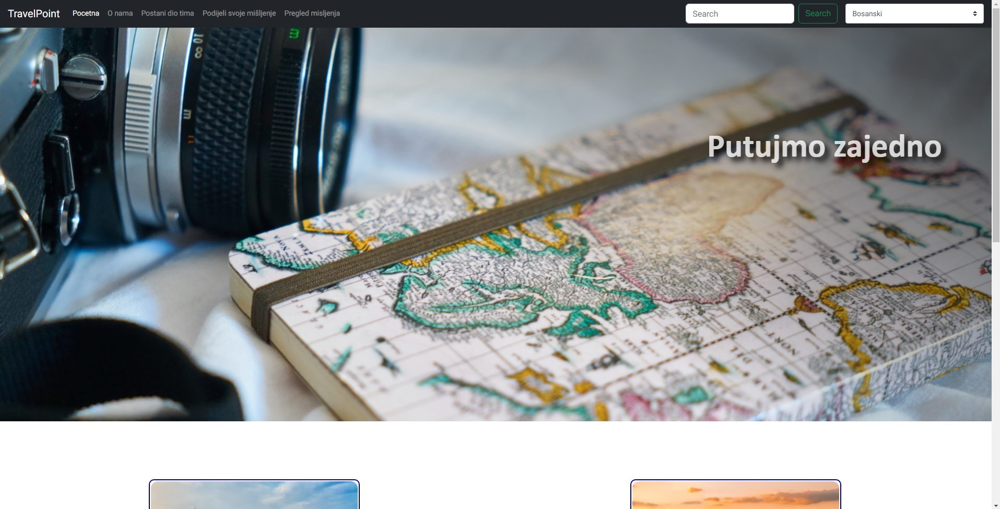
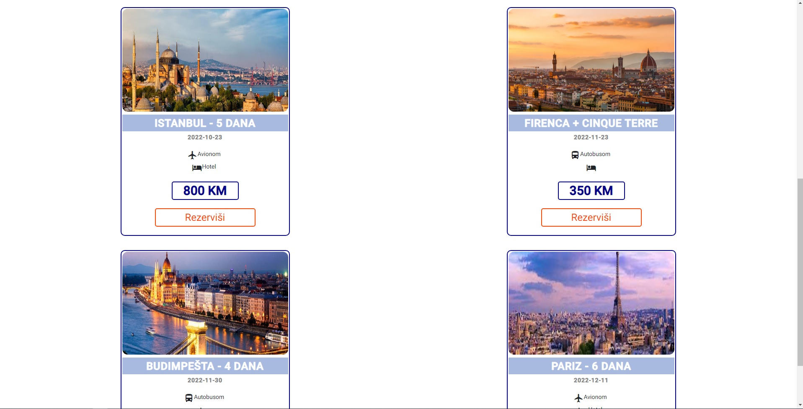

Reservation

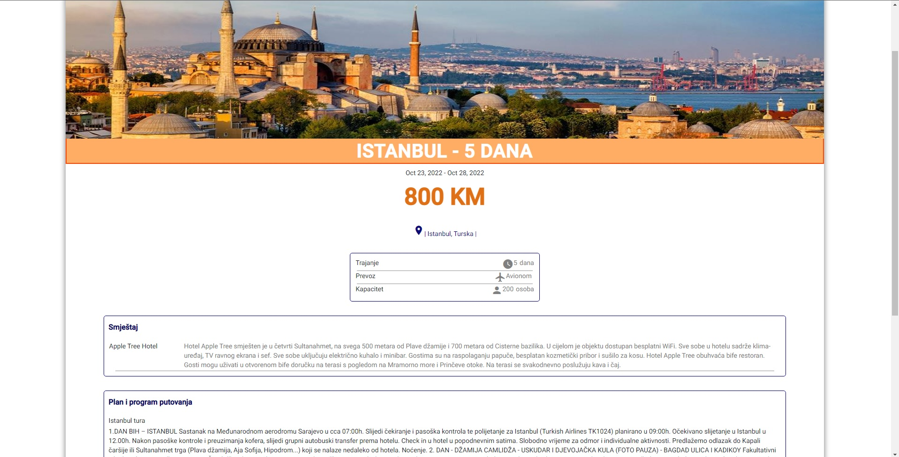
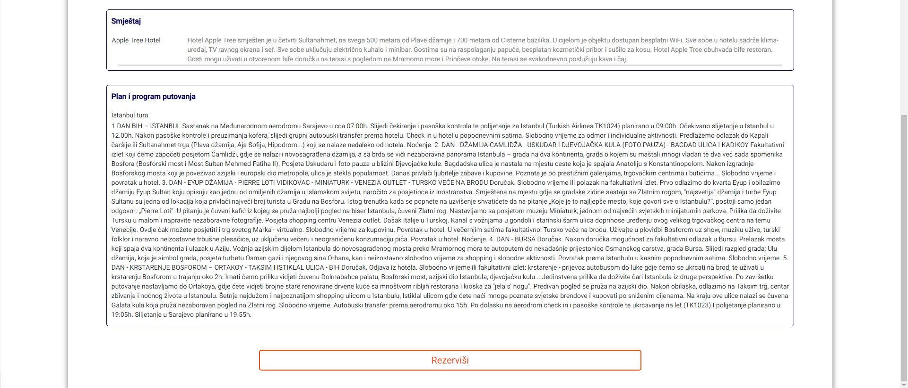

Job application

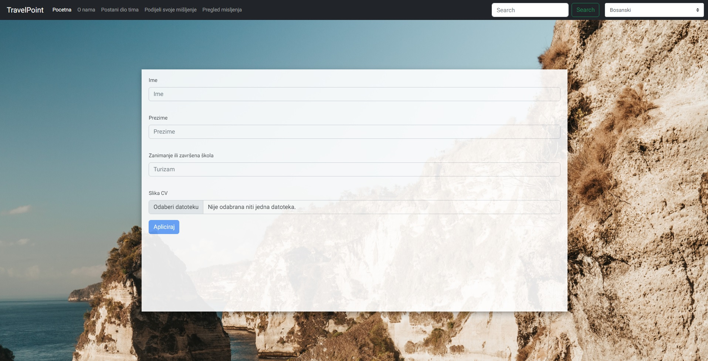

Login screen

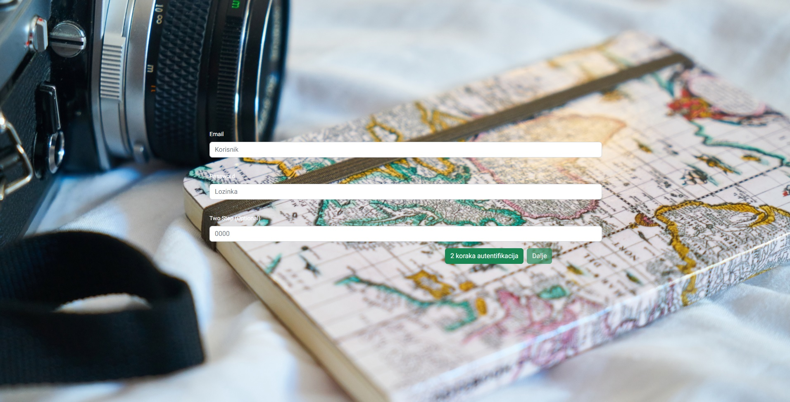

Admin panel

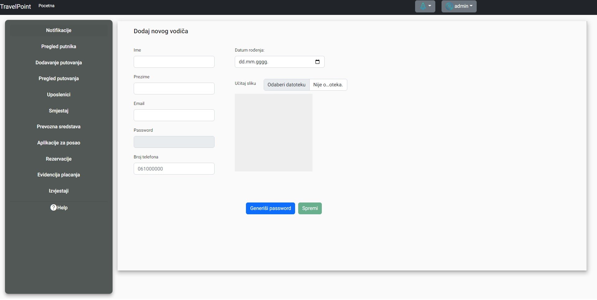
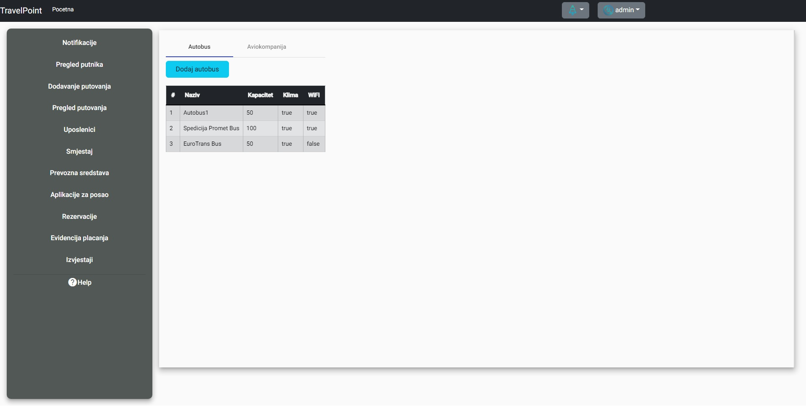
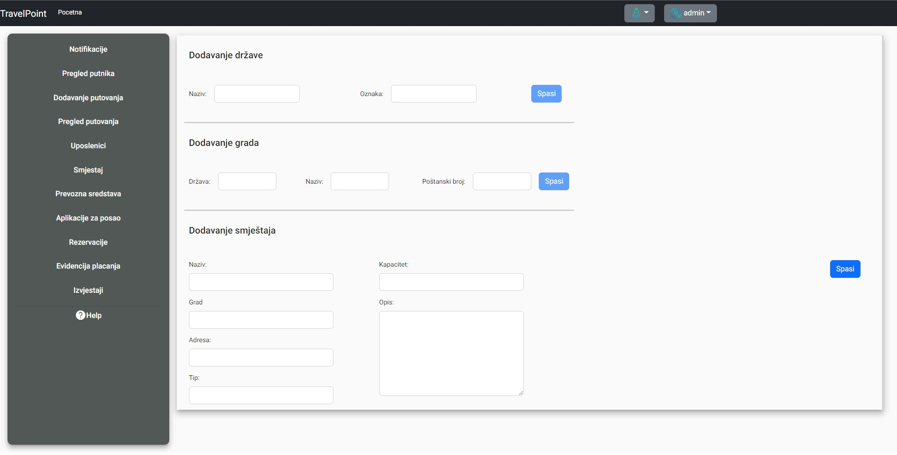
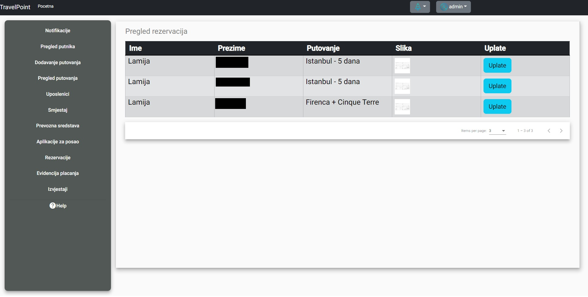
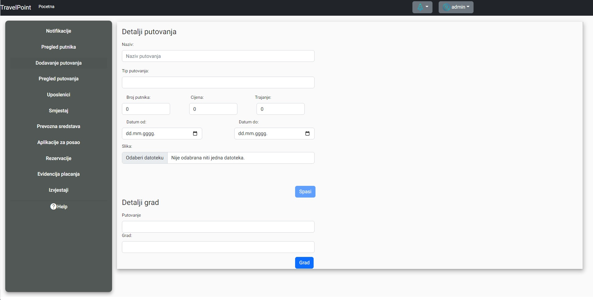
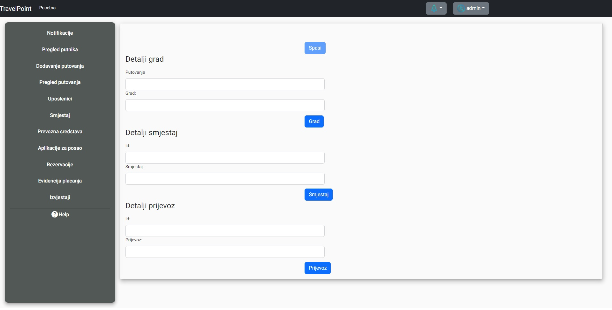

Guide panel

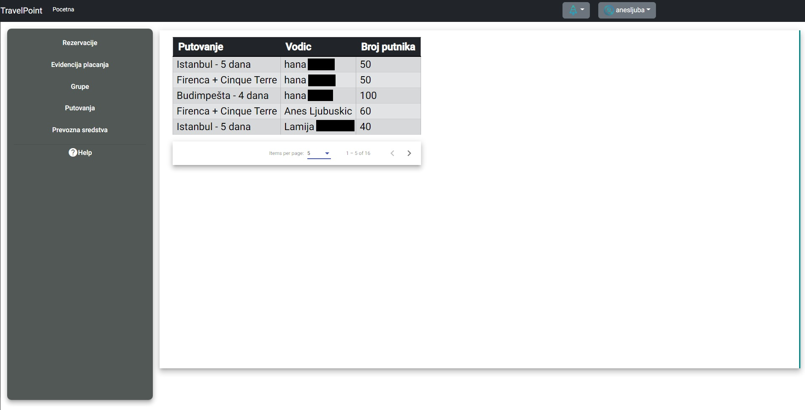
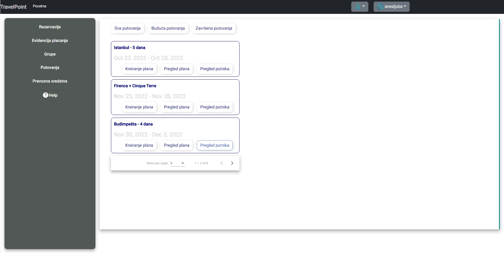
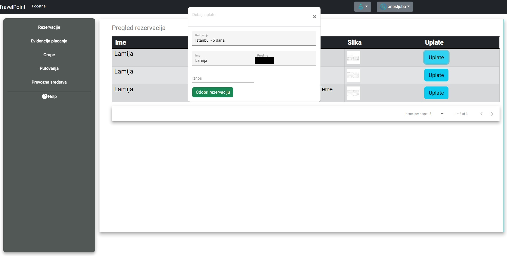

Others (email, 2step)
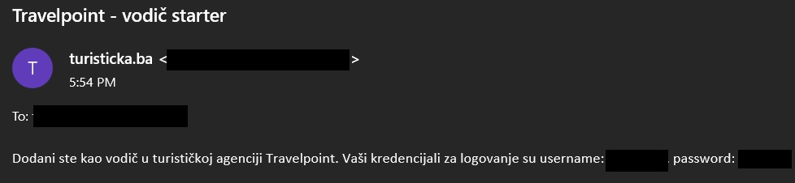
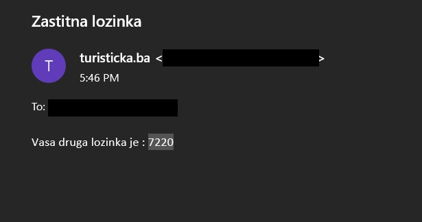
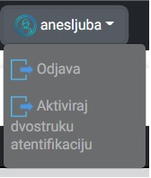
